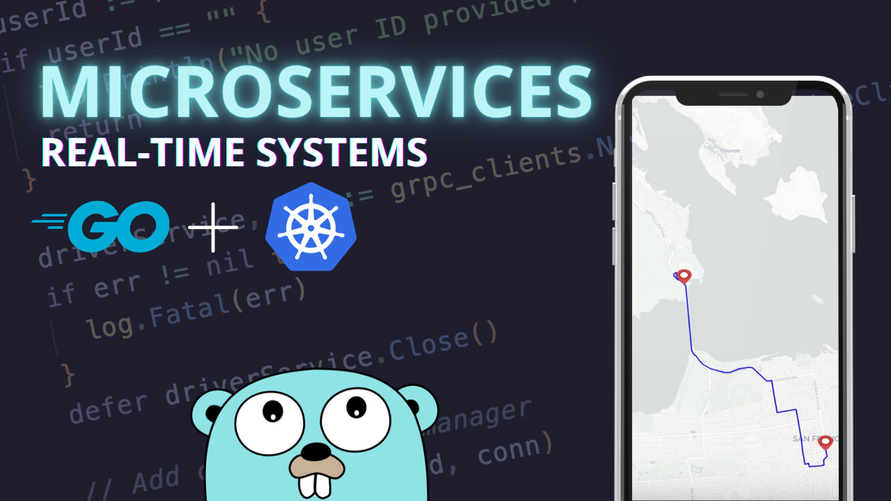

# "Microservices with Go" course project

Get the starter code [here](https://github.com/SelfMadeEngineerCode/microservices-go-starter)!

In this project‑driven course, you’ll build the backend microservices system for a Uber‑style ride‑sharing app from the ground up—using Go, Docker, and Kubernetes.

By the end, you’ll have a fully deployed, horizontally scalable ride‑sharing system that’s ready for real traffic. Plus, you’ll walk away with reusable template for building future distributed projects—accelerating your path to become a lead engineer.

Check it out at: https://www.selfmadeengineer.com/

<div align="center">
  
</div>

## Trip Scheduling Flow

[](https://mermaid.live/edit#pako:eNqNVt9v2jAQ_lcsP21qGvGjZSEPlSpaTX1YxWDVpAmpMvZBIkicOQ6UVf3fd4mdEgcKzQOK47v7vjt_d-aVcimAhnSW5vC3gJTDXcyWiiWzlOCTMaVjHmcs1eQpB3X49Xb88J1p2LLd4d4vFWdTUJuYw-HmnYo3oM5sH34fs10Cqf7Qb6oRFL-bnZLz5c3NnmRIRgrwteJGJmXOuTa2eyP0aFAPyXIyHtWO5YaxN7-PEoNJpNrM1nOSCw3Y_QuPWLq0nBvWl4h30fIos_Bhg5n6vMIVDTgVLyNN5II4LO9L65A8wrbyJimAyAkjwlbSBHBwENisQ2vl80T4pfezapbGRW1RHckkYaloILMNi9dsvgYXtHUQv2E-lXwF-hCccQ5ZE3sNiwZ0A_O2sjSw6oPTbB_nWbT3TB3dGEiykGrLlABBtCQTNp_H-sdP8sUwK3EmkGcS2-lnAQV8rUtwVCchGSvJIc8tJ2KoMGxDjxSZKIVapZZrpovc9_2j4nF7whGPifvM8jxepp8XkW2SzAQmOVKMZXoyF6_Nwq5bunetkLxp2HfIUQR8JQts5Bqz9DJGx3K1ZtZdHAVpCc9mZStkc3s-0WZtTFukOsGnB5QeE7u6PM4gKScQsozktmF_TmuN1qidUHZJa6q9V04m2RowlrV1SnbQc5GUq33YacFL_R2faHtPzxXt0ZN1O-6iXbRW1Zu4HxeiqjTJivk6ziPTcp-U1aXD-NPgZ46a21KL061Qj6kzc38_facarzCyv1tOdGgVk7OUpCipOSxjZEI9moBKWCzwKn8tQ8yojiCBGQ3xVTC1muEV_4Z2rNByuks5DbUqwKNKFsuIhgu2znFlZo79C1Cb4L36R8rmkoav9IWGvW_-1XVn0O_1-kE3GAyHgUd3-Lnb8fu9frc_xKfbvQ6CN4_-qyJ0_KDX7Q86QTDoDAfD66ve23_1IPGQ)

## Installation

The project requires a couple tools to run, most of which are part of many developer's toolchains.

- Docker
- Go
- Tilt
- A local Kubernetes cluster

### MacOS

1. Install Homebrew from [Homebrew's official website](https://brew.sh/)

2. Install Docker for Desktop from [Docker's official website](https://www.docker.com/products/docker-desktop/)

3. Install Minikube from [Minikube's official website](https://minikube.sigs.k8s.io/docs/)

4. Install Tilt from [Tilt's official website](https://tilt.dev/)

5. Install Go on MacOS using Homebrew:

```bash
brew install go
```

6. Make sure [kubectl](https://kubernetes.io/docs/tasks/tools/install-kubectl-macos/) is installed.

### Windows (WSL)

This is a step by step guide to install Go on Windows using WSL.
You can either install via WSL (recommended) or using powershell (not covered, but similar to WSL).

1. Install WSL for Windows from [Microsoft's official website](https://learn.microsoft.com/en-us/windows/wsl/install)

2. Install Docker for Windows from [Docker's official website](https://www.docker.com/products/docker-desktop/)

3. Install Minikube from [Minikube's official website](https://minikube.sigs.k8s.io/docs/)

4. Install Tilt from [Tilt's official website](https://tilt.dev/)

5. Install Go on Windows using WSL:

```bash
# 1. Get the Go binary
wget https://dl.google.com/go/go1.23.0.linux-amd64.tar.gz

# 2. Extract the tarball
sudo tar -xvf go1.23.0.linux-amd64.tar.gz

# 3. Move the extracted folder to /usr/local
sudo mv go /usr/local

# 4. Add Go to PATH (following the steps from the video)
cd ~
explorer.exe .

# Open .bashrc file and add following lines at the bottom and save the file.
export GOROOT=/usr/local/go
export GOPATH=$HOME/go
export PATH=$GOPATH/bin:$GOROOT/bin:$PATH

# 5. Verify the installation
go version
```

6. Make sure [kubectl](https://kubernetes.io/docs/tasks/tools/install-kubectl-macos/) is installed.

## Run

```bash
tilt up
```

## Monitor

```bash
kubectl get pods
```

or

```bash
minikube dashboard
```

## Deployment (Google Cloud example)

It's advisable to first run the steps manually and then build a proper CI/CD flow according to your infrastructure.

## 0. Environments

```bash
REGION: europe-west1 # change according to your location
PROJECT_ID: <your-gcp-project-id>
```

## 1. Add secrets.yaml file to the production folder

Production folder needs to contain a secrets.yaml for the production environment, you can just copy secrets from the development folder for now.

## 2. Build Docker Images

Build all docker images and tag them accordingly to push to Artifact Registry.

```bash
# Build the Api gateway
docker build -t {REGION}-docker.pkg.dev/{PROJECT_ID}/ride-sharing/api-gateway:latest --platform linux/amd64 -f infra/production/docker/api-gateway.Dockerfile .

# Build the Driver service
docker build -t {REGION}-docker.pkg.dev/{PROJECT_ID}/ride-sharing/driver-service:latest --platform linux/amd64 -f infra/production/docker/driver-service.Dockerfile .

# Build the Trip service
docker build -t {REGION}-docker.pkg.dev/{PROJECT_ID}/ride-sharing/trip-service:latest --platform linux/amd64 -f infra/production/docker/trip-service.Dockerfile .

# Build the Payment service
docker build -t {REGION}-docker.pkg.dev/{PROJECT_ID}/ride-sharing/payment-service:latest --platform linux/amd64 -f infra/production/docker/payment-service.Dockerfile .
```

## 3. Create a Artifact Registry repository

Go to Google Cloud > Artifact Registry and manually create a docker repository to host your project images.

## 4. Push the Docker images to artifact registry

Docker push the images.
If you get errors pushing:

1. Make sure to `gcloud login`, select the right project or even `gcloud init`.
2. Configure artifact on your docker config `gcloud auth configure-docker {REGION}-docker.pkg.dev` [Docs](https://cloud.google.com/artifact-registry/docs/docker/pushing-and-pulling#cred-helper)

## 5. Create a Google Kubernetes Cluster

You can either run a `gcloud` command to start a GKE cluster or manually create a cluster on the UI (recommended).

## 6. Update manifests files

Connect to your remote cluster and apply the kubernetes manifests.

```bash
gcloud container clusters get-credentials ride-sharing --region {REGION}--project {PROJECT_ID}
```

Next, upload each manifest by hand to make sure the correct order is maintained.

```bash
# First, apply the app-config and secrets
kubectl apply -f infra/production/k8s/app-config.yaml
kubectl apply -f infra/production/k8s/secrets.yaml

# Jaeger
kubectl apply -f infra/production/k8s/jaeger-deployment.yaml

# RabbitMQ
kubectl apply -f infra/production/k8s/rabbitmq-deployment.yaml

# Wait for both Jaeger and RabbitMQ to be running successfully

# Then, apply the services
kubectl apply -f infra/production/k8s/api-gateway-deployment.yaml
# Wait until the API is up and then do the next and so on...
kubectl apply -f infra/production/k8s/driver-service-deployment.yaml
kubectl apply -f infra/production/k8s/trip-service-deployment.yaml
kubectl apply -f infra/production/k8s/payment-service-deployment.yaml
```

If you need to redeploy you can use the same command above or just `kubectl apply -f infra/production/k8s`
Sometimes pods might need to be deleted for new ones to be deployed.

```bash
kubectl get pods
kubectl delete pod <pod-name>

# or for all deployments
kubectl rollout restart deployment
```

## 7. Enjoy!

```bash
Get the External IP from the api-gateway
kubectl get services
```

Go back to locally developing your project by changing kubernetes context

```bash
kubectl config get-contexts

# For Docker Desktop
kubectl config use-context docker-desktop

# OR for Minikube
kubectl config use-context minikube
```

## Adding HTTPS to your API

0. Reserve a static IP in GCP:
   Go to the Google Cloud Console → VPC Network → External IP addresses.
   Click "RESERVE STATIC ADDRESS".
   Name it api-gateway-ip (to match your annotation).
   Choose the same region as your GKE cluster (or "global" if using a global Ingress).

Confirm your IP exists:

```bash
gcloud compute addresses list
```

1. Add the ingress deployment
2. Change from LoadBalancer to ClusterIP
3. Apply the config

```bash
kubectl apply -f infra/production/k8s/api-gateway-ingress.yaml
kubectl apply -f infra/production/k8s/api-gateway-deployment.yaml
```

4. Get the IP address:

```bash
kubectl get ingress api-gateway-ingress
```

You should also wait for SSL certificate to be provisioned. Check the status:

```bash
kubectl describe managedcertificate api-gateway-cert
```

Once the certificate is provisioned (you'll see a "Provisioning" status change to "Active")

5. The Ingress will automatically provision a Google-managed SSL certificate for the IP address. You can access your API using:

```bash
https://<IP_ADDRESS>
```

Note: Since this is using a self-signed certificate, browsers will show a security warning. This is normal and expected. You can:
Accept the warning in your browser (not recommended for production)
Use a proper domain name (recommended for production)

# 项目启动

打开：

[infra/development/k8s/secrets.yaml](D:/Code/ride-sharing-main/ride-sharing/infra/development/k8s/secrets.yaml)

至少替换：

```
stripe-secret-key: "<STRIPE_SECRET_KEY>"
stripe-webhook-key: "<STRIPE_WEBHOOK_KEY>"
```

以及：

```
uri: "<MONGODB_URI>"
```

其中 MongoDB URI 是硬性要求


MongoDB atlas云端：

```
yuflyren_ridesharedb_user
LczlJoJoDzIHPjA9
uri: "<REDACTED_MONGODB_URI>"

```

stripe：


注意先把 tiltfile里的 cmd.bat路径 改成 `\\`


另开一个 PowerShell：

```
kubectl get pods -w
```

等待这些 Pod 都进入 `Running`


最后：

打开docker，启动k8s

```
tilt up
```


然后访问：

- Web 前端：http://localhost:3000
- API Gateway：http://localhost:8081
- RabbitMQ 管理界面：http://localhost:15672，账号密码均为 `guest`
- Jaeger：http://localhost:16686
- Tilt 控制台：通常是 http://localhost:10350

前端代码在镜像构建时没有传入 `NEXT_PUBLIC_*` 参数，因此会采用代码中的 `localhost:8081` 默认值；这刚好适合 Tilt 的本地端口转发。


## 项目流程

首先确认 Tilt 中主要资源都是绿色，然后访问：

http://localhost:3000

### 1. 打开司机端

在第一个标签页：

1. 点击 `I Want to Drive`。
2. 选择车型，例如 `Sedan`。
3. 页面显示 `Waiting for a rider...` 后保持该标签页打开。

司机标签页必须保持打开，因为 WebSocket 断开后司机会自动注销。

### 2. 打开乘客端

在第二个标签页访问同一地址：

http://localhost:3000

然后：

1. 点击 `I Need a Ride`。
2. 地图默认定位在旧金山，不会读取你的真实位置。
3. 在地图上点击一个目的地。
4. 等待右侧出现路线、时间和车型报价。
5. 选择与司机端相同的车型，例如司机选择了 `Sedan`，乘客也要选 `Sedan`。
6. 页面进入 `Looking for a driver`。

车型必须一致，因为后端只会把订单发给相同 `packageSlug` 的司机。

### 3. 司机接受订单

返回司机标签页：

1. 应该出现 `Trip request received!`。
2. 点击 `Accept trip`。
3. 司机端显示 `All set!`。
4. 乘客端收到司机已分配的状态。

也可以点击 `Decline trip` 拒绝订单。


注意：

## 使用占位 Stripe Key 时的限制

你目前使用的是：

```
stripe-secret-key: "sk_test_placeholder"
stripe-webhook-key: "whsec_placeholder"
```

它们只能让 `payment-service` 启动，不能完成付款。因此演示流程通常会停在“司机已接单/正在创建支付会话”附近。

此外，前端目前也没有设置：

```
NEXT_PUBLIC_STRIPE_PUBLISHABLE_KEY
```

所以即使支付会话出现，付款按钮也可能显示：

```
Stripe API KEY is not set on the NEXTJS app
```

也就是说，目前可以测试：

```
司机上线 → 乘客选择目的地 → 获取报价 → 请求车辆 → 司机接受
```

不能使用占位符测试：

```
Stripe Checkout → 支付成功 → Webhook 回调
```

## 没有收到订单时

按顺序检查：

```
kubectl get pods
```

所有 Pod 应为 `Running`。然后确认：

- 司机页面先打开并保持在线；
- 司机和乘客选择了相同车型；
- MongoDB URI 有效；
- RabbitMQ、API Gateway、Trip Service、Driver Service 都正常；
- 不要刷新司机页面，刷新会生成新的司机 ID；
- 浏览器控制台没有 WebSocket 错误。

可以分别查看日志：

```
kubectl logs deployment/api-gateway
kubectl logs deployment/driver-service
kubectl logs deployment/trip-service
kubectl logs deployment/payment-service
```

这个项目目前更像微服务事件流演示，并不是完整打车产品：没有登录、真实 GPS、司机行驶控制或完整行程结束按钮。核心演示重点是乘客下单、RabbitMQ 事件传递、司机匹配和 WebSocket 实时通知。


# 司机派单当前逻辑

这是当前后端刻意采用的“随机选择一名司机”逻辑，不是 WebSocket 出错。

在 [trip_consumer.go (line 54)](D:/Code/ride-sharing-main/ride-sharing/services/driver-service/trip_consumer.go:54) 中，系统先找出相同车型的所有司机：

```
suitableIDs := c.service.FindAvailableDrivers(
    payload.Trip.SelectedFare.PackageSlug,
)
```

然后随机选一个：

```
randomIndex := rand.Intn(len(suitableIDs))
suitableDriverID := suitableIDs[randomIndex]
```

最后只向这个司机 ID 发布订单：

```
OwnerID: suitableDriverID
```

因此两个司机窗口同时在线时：

```
订单 → 找到司机 A、司机 B → 随机选一个 → 只有该司机收到接单页面
```

这符合“一张订单最终只能分配给一名司机”的基本设计，但目前实现还比较简化：

- 不会同时广播给附近所有司机；
- 没有按照距离选择司机；
- 司机拒绝后可能再次随机选中同一司机；
- 司机接单后没有标记为忙碌；
- 同一个司机可能继续收到其他订单；
- 车型必须相同，否则不会进入候选列表。

如果想演示第二位司机，可以让第一位点击 `Decline trip`。后端会再次寻找司机，但由于没有排除已拒绝的司机，仍可能再次选中第一位。

更合理的实现通常有两种：

1. 顺序派单：选择最近司机，超时或拒绝后排除他，再派给下一位。
2. 批量广播：同时通知多名司机，但第一个接受的人需要通过原子操作锁定订单，其他司机立即收到“订单已被接走”。

当前项目只实现了最简单的“随机单播”。如果你的目标是演示多人抢单，需要补充广播与防重复接单机制。
